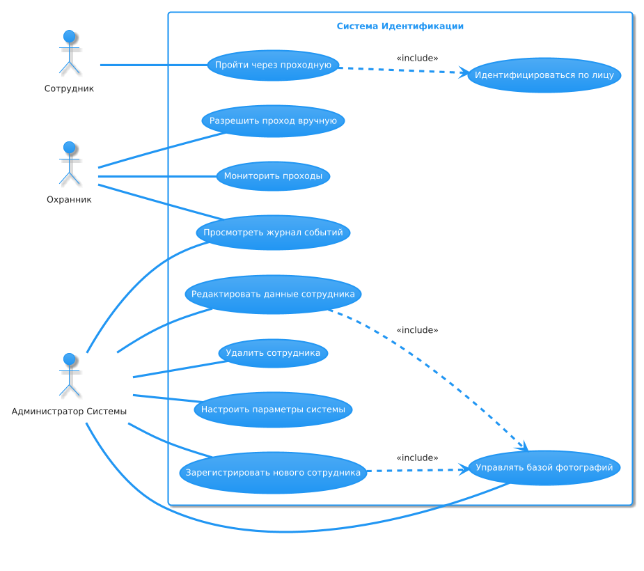

# Дизайн ML системы - Система идентификации личности по фотографии

## 1. Цели и предпосылки

### 1.1. Зачем идем в разработку продукта?

**Бизнес-цель**

Создать автоматизированную систему идентификации личности по фотографии для замены традиционных методов (пропусков, паролей, отпечатков пальцев) в сценариях контроля доступа на промышленном предприятии.

**Улучшения**

- ускорение обработки потока сотрудников
- масштабируемость (при увеличении количества сотрудников система легко адаптируется без увеличения штата охраны)
- экономия на лишних сотрудниках охраны
- повышенная точность, чем у человека
- повышение качества жизни сотрудников

**Критерии успеха с точки зрения бизнеса**

- увеличение скорости прохода сотрудников во время часа пик
- избавление от расходов на пластиковые пропуски
- False Acceptance Rate (FAR) < 0.1% (чужой не проходит)
- False Rejection Rate (FRR) < 1% (свой не блокируется)
- положительный отклик сотрудников

### 1.2. Бизнес-требования и ограничения

**Краткое описание бизнес-требований**

- Реализация системы биометрической идентификации на базе компьютерного зрения
- Интеграция с существующей СКУД предприятия
- Обеспечение работы системы в режиме 24/7 с uptime > 99.9%
- Поддержка распознавания при различных условиях освещения и ракурсах
- Ведение журнала событий доступа с возможностью аудита

**Бизнес-ограничения**

- бюджет (7млн руб)
- сроки (4 месяца)
- конфиденциальность личной информации, которая храниться в системе

**Ожидания от конкретной итерации (от пилота)**

Необходимо реализовать полный функционал системы на одной проходной с более мягкими требованиями к возможностям ошибки системы

**Описание бизнес-процесса пилота, насколько это возможно**

Бизнес процесс пилота идентичен стандартному бизнес-процессу рабты системы распознования (см. пункт 4.1) за тем отличием, что он распространяется только на 1 проходную

**Критерии успеха пилота и возможные пути развития проекта**

- увеличение скорости прохода сотрудников во время часа пик
- False Acceptance Rate (FAR) < 0.5% (чужой не проходит)
- False Rejection Rate (FRR) < 5% (свой не блокируется)

//При успехе пилота проект признается рентабельным и продолжается работа над его дальнейшим внедрением

### 1.3. Предпосылки решения

**Данные:**

- фотографии сотрудников (3 фото на человека, разрешение ≥ 256×256 px)
- негативные примеры фотографий (с бликами, с попытками обмана системы)

**Критические допущения:**

- модель предполагает, что лицо человека не меняется
- Дообучение 1 раз в 6 месяца (для учета изменений лиц)

## 2. Методология

### 2.1. Постановка задачи

С технической точки зрения разрабатывается система биометрической верификации (1:1 сравнение) и идентификации (1:N поиск) личности по фотографии в реальном времени. 

**Ключевые технические подзадачи:**
- Детекция и выравнивание лиц на изображении с камер проходных
- Генерация эмбеддингов (векторных представлений лиц)
- Сравнение эмбеддингов с базой данных сотрудников
- Обработка edge-кейсов: маски, очки, плохое освещение
- Интеграция с системой контроля доступа (СКУД)

### 2.2. Блок-схема решения

Product schema

### 2.3. Этапы решения задачи

#### Этап 0 - Подготовка данных

**Данные и сущности:**

| Название данных | Источник данных | Требуемый ресурс | Качество проверено |
|----------------|----------------|------------------|--------------------|
| Фотографии сотрудников (анфас/профиль) | HR-база (фото для пропусков) | Data Engineer | Частично |
| Негативные примеры (блики, маски) | Тестовые съемки | CV-инженер | Нет |
| Логи доступа | СКУД предприятия | IT-отдел | Да |

**Результат этапа:**
- Нормализованный датасет с разметкой (bbox лиц, landmarks)
- ETL-пайплайн для автоматического обновления базы
- Балансировка классов (разные ракурсы/условия)

#### Этап 1 - Построение бейзлайн-модели

**Для MVP:**
- **Архитектура:** FaceNet (предобученная на VGGFace2) + fine-tuning
- **Выборка:** 80/10/10 (train/val/test)
- **Метрики:** 
  - FAR < 0.5% 
  - FRR < 5%
- **Feature engineering:** гистограммная нормализация, аугментация

**Для бейзлайна:**
- **Метод:** OpenCV Haar Cascades + LBPH
- **Целевые метрики:** FAR < 10%, FRR < 20%

**Риски и митигация:**
- Низкое качество исходных фото → Ручная верификация выборки

#### Этап 2 - Оптимизация решения

**Для MVP:**
- **Модель:** ArcFace (ResNet-100) с Triplet Loss
- **Валидация:** 5-fold cross-validation
- **Метрики:**
  - FAR < 0.5%
  - FRR < 5%
- **Горизонт:** обработка кадра с камеры за приемлемое время < 1-2 сек
- **Гранулярность:** Отдельное изображение/кадр
- **Частота пересчета:** 1 раз в 6 месяцев 

**Необходимый результат:**
- Подтверждение метрик на симулированном потоке
- API для интеграции с СКУД

**Риски и митигация:**
- Не удается достичь целевых метрик FAR/FRR → Сбор дополнительных, более разнообразных или сложных данных; использование более сложных архитектур; пересмотр порогов; ансамблирование
- Переобучение модели → Тщательная валидация, регуляризация, аугментация, сбор большего количества данных
  
#### Этап 3 - Тестирование

**Сценарии:**
1. Нагрузочное тестирование (5к запросов/час)
2. Проверка edge-кейсов:
   - Люди в масках/очках
   - Попытки обмана системы

**Критерии:**
- Uptime > 99.9%
- Задержка < 1 сек
- FAR < 0.5%
- FRR < 5%

**Риски и митигация:**
- Обнаружение критических уязвимостей или значительное падение метрик на специфичных данных.  → Возврат на Этап 2 для доработки модели/системы
- Несоответствие производительности ожиданиям → Дополнительная оптимизация, пересмотр аппаратных требований для пилота
  
#### Этап 4 - Документирование

**Выходные артефакты:**
- Техническая документация API
- Пользовательская документация
- Инструкции для охраны
- Docker-образы модели
- Рефакторинг кода

**Риски и митигация:** 
- Недостаточная или неактуальная документация →  Выделение достаточного времени на написание и ревью документации

**Бизнес-проверка:** 
- Проверка, что пользовательская документация соответствует потребностям
  
#### Этап 5 - Пилотное внедрение

**Бизнес-метрики:**
- Сокращение времени прохода на 30%
- < 20 жалоб сотрудников за 2 недели
- FAR < 0.5%, FRR < 5
- uptime > 99.9%

**Риски и митигация:** 
- Технические проблемы с оборудованием или интеграцией  →  Тщательная подготовка, наличие "горячей" поддержки от технических специалистов
- Негативная реакция сотрудников на новую систему → Предварительное информирование, четкие инструкции
- Реальные метрики значительно хуже ожидаемых → Глубокий анализ причин, доработка

#### Этап 6 - Мониторинг и доработки
**Результаты:** 
- Стабильно работающая система, соответствующая заявленным бизнес-требованиям
- Налаженный процесс сбора обратной связи и управления изменениями/доработками

**Риски и митигация:** 
- Появление новых способов обмана системы  →  Появление новых способов обмана системы

#### Этап 7 - Масштабирование

**Интеграционные задачи:**
- Развертывание отказоустойчивой кластерной версии

**Метрики:**
- Uptime > 99.9%
- Задержка < 1 сек
- FAR < 0.1%
- FRR < 1%

**Результаты:** 
- Система биометрической идентификации полностью внедрена и функционирует на всех запланированных точках доступа предприятия
- Достигнуты все ключевые бизнес-цели проекта.

**Риски и митигация:** 
- Проблемы с производительностью и стабильностью при полной нагрузке →  Тщательное нагрузочное тестирование перед полномасштабным запуском, возможность горизонтального и вертикального масштабирования инфраструктуры
- Логистические сложности при развертывании на большом количестве объектов → Детальный план-график, выделение достаточных ресурсов, координация между отделами

**Бизнес-проверка:** 
- Официальная приемка системы в промышленную эксплуатацию

## 3. Оценка и подготовка пилота

### 3.1. Способ оценки пилота

Оценка пилота будет комбинированной:

**Количественная оценка** *(Data Scientist, Product Owner)*
-   **Метод:** A/B тестирование (с контрольной группой, если возможно) или Before/After анализ на пилотной проходной.
-   **Метрики:**
    -   False Acceptance Rate (FAR) – анализ логов, жалоб.
    -   False Rejection Rate (FRR) – анализ логов, жалоб.
    -   Скорость прохода сотрудников.
    -   Пропускная способность проходной.
    -   Время отклика системы.
    -   Uptime системы.

**Качественная оценка** *(Product Owner, HR)*
-   **Методы:**
    -   Анкетирование и интервью с сотрудниками, участвующими в пилоте.
    -   Наблюдение за работой охраны и сбор их обратной связи.

-   **Оценка:**
    -   Удобство использования системы сотрудниками.
    -   Восприятие безопасности и приватности.
    -   Простота освоения и использования системы охраной.

**Дизайн эксперимент:**
-   **Выборка:** Репрезентативная группа сотрудников из 300 человек, регулярно использующих пилотную проходную.
-   **Длительность:** 2-4 недели для сбора достаточного количества данных и адаптации пользователей.
-   **Процедура:** Четкие инструкции для всех участников, определены каналы для обратной связи.

### 3.2. Что считаем успешным пилотом

Пилот считается успешным при достижении следующих критериев:

-   **Метрики модели:**
    -   False Acceptance Rate (FAR) ≤ 0.5% 
    -   False Rejection Rate (FRR) ≤ 5%

-   **Улучшение бизнес-процессов:**
    -   Увеличение скорости прохода сотрудников (на 15-20% быстрее или как минимум не хуже существующей системы), особенно в часы пик.

-   **Стабильность и надежность системы:**
    -   Uptime системы ≥ 99.9% в течение пилотного периода.

-   **Принятие пользователями:**
    -   Положительный отклик от ≥ 70% опрошенных сотрудников.
    -   Удовлетворенность сотрудников охраны простотой использования и эффективностью системы.

-   **Экономическая целесообразность (предварительная оценка):**
    -   Подтверждение потенциала для достижения долгосрочных бизнес-целей (экономия на пропусках, оптимизация охраны).
    -   Стоимость эксплуатации пилотной системы соответствует ожиданиям.

### 3.3. Подготовка пилота

**Оценка вычислительных затрат и ограничения**

-   **Расчет на бейзлайне (по результатам Этапа 1):**
    -   Проводится оценка времени инференса модели на одном изображении.
    -   Оценивается потребление ресурсов (RAM, CPU/GPU).
    -   Формируется предварительный расчет требуемой производительности сервера для одной проходной.

-   **Работа с MVP моделью (по результатам Этапа 2):**
    -   Проводятся точные замеры производительности MVP модели на целевом оборудовании для пилота.
    -   Анализируется необходимость и возможность применения техник оптимизации (квантование, TensorRT и т.п.) для достижения требуемой скорости без значительной потери точности.
    -   Определяется максимальное допустимое время отклика системы (например, не более 1-2 секунд на сотрудника).

**Что можем позволить себе (исходя из ожидаемых затрат на вычисления для пилота):**

-   **Бюджет на оборудование:** Ограничения бюджета могут повлиять на выбор сложности модели. Возможные компромиссы:
    -   Использование более легковесных архитектур.
    -   Интенсивное применение методов оптимизации.
    -   Рассмотрение CPU-обработки, если производительность достаточна.

-   **Частота обработки кадров:** Для снижения нагрузки возможна обработка не каждого кадра, а, например, каждого N-го, или активация по детектору движения.

**Установка ограничений по вычислительной сложности для модели пилота:**

-   **Максимальное время инференса на запрос:** (например, < 0.5 секунды на целевом GPU, < 1.5 секунды на целевом CPU).
-   **Максимальное потребление RAM/VRAM:** Модель должна помещаться на доступное оборудование.
-   Если установленные ограничения не позволяют достичь целевых метрик FAR/FRR, это фиксируется как риск. Потребуется либо пересмотр требований к оборудованию, либо дальнейшая оптимизация модели, либо корректировка ожиданий от пилота.

## 4. Внедрение для production систем
### 4.1. Архитектура решения

Диаграмма активностей

ER диаграмма

Use Case Diagram

Component Diagram

### 4.2. Описание инфраструктуры и масштабируемости

**Выбранная архитектура:**  
`Гибридная система (Edge + Cloud)`  

**Компоненты:**  
1. **Edge-устройства:**  
   - NVIDIA Jetson AGX Orin (32GB) на каждой проходной  
   - 4K камеры с ИК-фильтром  
2. **Центральный кластер:**  
   - 3×GPU-сервера (A100 40GB) в Kubernetes  
   - Ceph-хранилище (100TB) для журналов событий  

**Плюсы:**  
✓ **Низкая задержка:** Первичная обработка на edge (200-300 мс)  
✓ **Отказоустойчивость:** Работа без облака при потере связи  
✓ **Масштабируемость:** Добавление проходных = +1 Jetson + камера  
✓ **Бюджет:** Экономия 40% vs pure-cloud при 10+ проходных  

**Минусы:**  
✗ **Сложность обновлений:** Требует синхронизации edge-устройств  
✗ **Ограниченный AI:** На edge — только верификация (1:1), идентификация (1:N) — в облаке  

**Сравнение с альтернативами:**  

| Вариант               | CAPEX (10 проходных) | Задержка | Риски                     |
|-----------------------|----------------------|----------|---------------------------|
| **Гибрид (наш выбор)**| 4.2M руб             | 400 мс   | Сложная диагностика       |
| Pure-Cloud            | 6.7M руб             | 900 мс   | Зависимость от интернета  |
| Pure-Edge             | 3.8M руб             | 300 мс   | Ограничение базы до 1K лиц|

**Финальный выбор обоснован:**  
1. Соответствует SLA (99.9% uptime)  
2. Позволяет масштабироваться до 50+ проходных без замены архитектуры  
3. Оптимален по соотношению цена/производительность при N ≥ 5  

### 4.3. Требования к работе системы

| Параметр               | Значение                        |
|------------------------|---------------------------------|
| **Общая доступность**  | 99.95%                         |
| **Задержки:**          |                                 |
| - Верификация (1:1)    | ≤500 мс (p95)                  |
| - Идентификация (1:N)  | ≤1200 мс (p99)                 |
| **Пропускная способность** | 200+ запросов/мин на узел  |
| **Время восстановления** | ≤15 минут                     |

### 4.4. Потенциальные уязвимости и меры защиты

| №   | Уязвимость                                       | Описание                                                                                                                                        | Ключевые меры защиты                                                                                                                                                              |
|-----|---------------------------------------------------|-------------------------------------------------------------------------------------------------------------------------------------------------|-----------------------------------------------------------------------------------------------------------------------------------------------------------------------------------|
| **Атаки на модель и данные**                            |                                                                                                                                                 |                                                                                                                                                                                   |  |
| 1   | **Спуфинг-атаки (Presentation Attacks)**          | Попытка обмануть систему, предъявив ей неживое изображение (фотография, видео с экрана, 3D-маска).                                                  | - Внедрение Anti-spoofing (Liveness Detection).  - Обучение модели на данных со спуфинг-атаками.                                                                                |
| 2   | **Атаки уклонения (Evasion Attacks)**               | Злоумышленник пытается изменить свой внешний вид (грим, очки, специфическая мимика) так, чтобы модель его не распознала или распознала неверно. | - Обучение модели на разнообразных данных (аксессуары, мимика).  - Robustness-тестирование.  - Постоянное дообучение модели.                                                     |
| 3   | **Кража модели или базы эмбеддингов**             | Несанкционированное получение доступа к обученной модели или базе данных с биометрическими шаблонами (эмбеддингами) сотрудников.                  | - Шифрование базы эмбеддингов (at rest, in transit).  - Строгий контроль доступа к серверам.  - Регулярные аудиты безопасности.                                                     |
| **Атаки на инфраструктуру и ПО**                       |                                                                                                                                                 |                                                                                                                                                                                   |  |
| 4   | **Уязвимости сетевого взаимодействия**           | Перехват или модификация данных, передаваемых между камерами, сервером распознавания и СКУД.                                                    | - Использование защищенных протоколов (HTTPS/TLS, SRTP).  - Аутентификация компонентов.  - Сетевая сегментация.                                                                 |
| 5   | **Уязвимости операционной системы и ПО**         | Использование известных или 0-day уязвимостей в ОС сервера, СУБД, веб-сервере, библиотеках машинного обучения.                                  | - Регулярное обновление ПО и установка патчей.  - Запуск сервисов с минимальными привилегиями.  - IDS/IPS, сканирование на уязвимости.                                              |
| 6   | **Отказ в обслуживании (DoS/DDoS)**              | Перегрузка сервера распознавания большим количеством запросов, что приводит к недоступности сервиса для легитимных пользователей.               | - Ограничение частоты запросов (Rate Limiting).  - Межсетевые экраны с защитой от DoS.  - Масштабируемая архитектура.                                                                 |
| 7   | **Несанкционированный доступ к административным интерфейсам** | Получение доступа к интерфейсам управления системой, базой данных, настройками.                                                    | - Надежные пароли и MFA для администраторов.  - Разграничение ролей и прав доступа.  - Логирование административных действий.  - Ограничение доступа по IP.             |
| **Физические и организационные уязвимости**             |                                                                                                                                                 |                                                                                                                                                                                   |  |
| 8  | **Физический доступ к оборудованию**             | Несанкционированный доступ к камерам, серверам, сетевому оборудованию.                                                                            | - Физическая охрана серверных и проходных.  - Ограничение доступа к оборудованию.  - Видеонаблюдение.                                                                             |
| 9  | **Недостаточная осведомленность пользователей**   | Сотрудники могут не понимать правила использования системы или не сообщать о подозрительной активности.                                          | - Регулярное обучение сотрудников ИБ и правилам системы.  - Четкие инструкции по инцидентам.                                                                                      |

**Общие рекомендации:** Security by Design, регулярные аудиты безопасности, план реагирования на инциденты, соответствие нормативным требованиям.

### 4.5. Безопасность данных и соответствие законодательству

Да, **потенциально могут быть нарушения**, если не предпринять специальных мер. Фотографии лиц и их биометрические шаблоны (эмбеддинги) являются **персональными данными (ПДн)**.

**Ключевые аспекты для рассмотрения с юристами:**

1.  **Применимое законодательство:**
    *   **ФЗ-152 "О персональных данных" (РФ)** 

2.  **Правовое основание для обработки:**
    *   Необходимо четкое и законное основание (например, согласие сотрудников, законный интерес работодателя). Согласие должно быть явным, информированным и свободно данным.

3.  **Оценка воздействия на защиту данных (DPIA / PIA):**
    *   Для обработки биометрических данных в больших масштабах, как правило, **требуется** проведение DPIA для выявления и минимизации рисков для прав и свобод субъектов данных.

4.  **Минимизация данных и ограничение цели:**
    *   Собирать только необходимые данные (например, минимальное количество фото).
    *   Использовать данные строго для заявленной цели (контроль доступа).

5.  **Технические и организационные меры защиты:**
    *   **Data Scientist отвечает за предложение и реализацию технических мер:** шифрование эмбеддингов, безопасное хранение, контроль доступа к данным, псевдонимизация (если возможно), безопасная передача данных.
    *   Организационные меры разрабатываются совместно с юристами.

6.  **Прозрачность и права субъектов данных:**
    *   Сотрудники должны быть полностью информированы об обработке их биометрических данных.
    *   Должны быть обеспечены их права (доступ, исправление, удаление и т.д.).

### 4.6. Расчетные издержки на работу системы в месяц

- Обслуживание оборудования - 25000руб
- Электроэнергия - 10000руб
- HR-поддержка - 20000руб
- Техподдержка (частичная занятость) - 40000руб

### 4.7. Integration points

Диаграмма взаимодействия между сервисами

### 4.8. Риски

- технические риски (низкое качество распознавания, сбои оборудования)
- организационные риски (недовольство сотрудников, ошибки охраны в работе с системой)
- экономические риски (превышение срока окупаемости, превышение сметы)
- юридические риски (нарушение закона о хранении персональных данных)

**Вывод:**
Технически мы можем реализовать безопасное хранение и обработку. Однако, **окончательное заключение о соответствии законодательству и допустимости такого решения должно быть получено от юридического отдела** после анализа всех аспектов и, вероятно, проведения DPIA. Data Scientist должен предоставить юристам полную информацию о том, какие данные, как и для чего обрабатываются.
